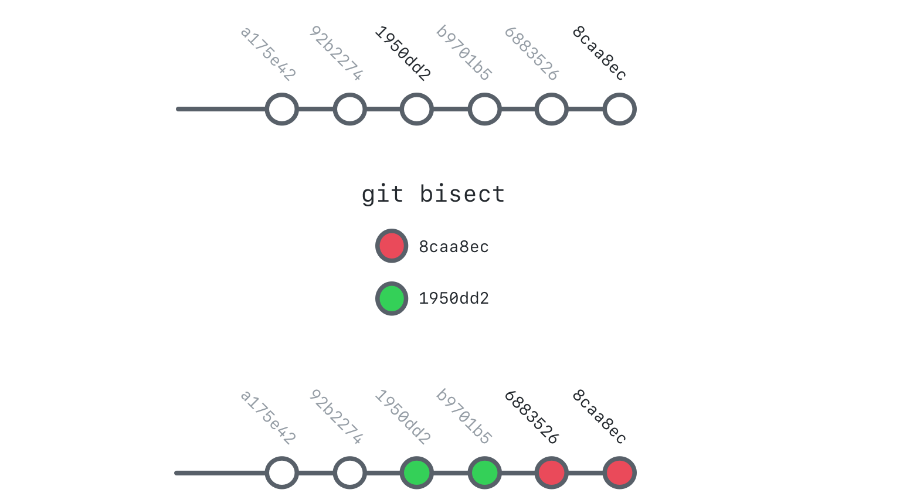

## Searching for Events in Your Code

In this section, we will learn how we can use `git bisect` to find the commit that introduced a bug into our repository.

### What is `git bisect`?

Using a binary search, `git bisect` can help us detect specific events in our code. For example, you could use bisect to locate the commit where:

- a bug was introduced.
- a new feature was added.
- a benchmark’s performance improved.

#### How it works

`git bisect` works by cutting the history between two points in half and then checking you out to that commit. You then check whether the bug/feature exists at that point and tell Git the result. From there, Git will do another division, etc until you have located the desired commit.

> When you are doing a bisect, you are essentially in a detached head state. It is important to remember to end the bisect with `git bisect reset` before attempting to perform other operations with Git.

### Finding the Bug in Our Project

#### The Long Way

1. Initiate the binary search: `git bisect start`.
1. Specify the commit where you noticed the code was broken: `git bisect bad <SHA>`.
1. Specify the commit where you knew things were working: `git bisect good <SHA>`.
1. Bisect will check you out to the midpoint between good and bad.
1. Run a test to see if the game would work at this point. Our test is to use `ls` to see if an `index.html` file exists.
1. If the game is still broken (there *is no* `index.html` file), type: `git bisect bad`.
1. If the game works (and there *is* an `index.html` file), type: `git bisect good`.
1. Git will bisect again and wait for you to test. This will happen until Git has enough information to pinpoint the first bad commit.
1. When Git has detected the error, it will provide a message that `SHA is the first bad commit.`
1. Exit the bisect process: `git bisect reset`.

#### The Short Way

Bisect can also run the tests on your code automatically. Let's try it again using a shortcut command and a test:

1. `git bisect start <bad-SHA> <good-SHA>`
1. `git bisect run ls index.html`
1. `git bisect reset`
