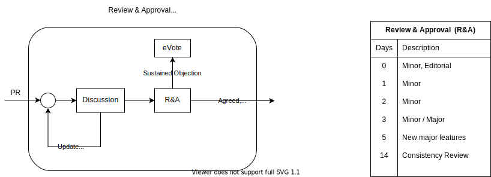

# How we work togeter

## Consensus Based Projects

These projects are run via consensus with the same rules as the associated working group. If as an individual member you have concerns with the direction of these projects you may choose to raise an objection which needs to be resolved.

## GitHub Consensus Based Projects
For example, projects related to creating whitepapers or specifications.

## Owners
Only Chairs/Project leads have the right to accept or reject any changes.

## How do you reach an agreement?

<figure>
	
	<figcaption></figcaption>
</figure>

## Drafting phase
 - An editing team is assigned to the document, they will write the initial draft and people can volunteer to be part of that team. 
 - Only the editing team has write access to the doc. 
 - Once the editing team has finished the initial draft and reached consensus amongst themselves it enters the discussion phase. 
 - The doc should clearly state who the editing team are and which working group it belongs to. 

## Discussion Phase
 - The document is shared for discussion with the whole group for comments, no suggested edits are allowed, just comments. 
 - Comments should never be deleted, only resolved, resolved comments can be reopened and the history is visible, deleted comments are deleted forever. 
 - The editors are responsible to read the comments and reword the doc to reach consensus.  
 - The original commenter should be informed of any updates to the doc based on their feedback so they have an opportunity to review, this can be done simply by replying to the original comment. 
 - Any comments that are not in the review and approval phase are advisory only. It’s up to the editing team to decide whether to incorporate the feedback into the doc or not. 
 - The editing team may choose to resolve a comment without making any changes to the doc at all. 
 - The original commenter can restore their comment if they are not happy with the resolution they can sustain an objection and ask for the comment to enter the review and approval phase. 
 - In order to ensure the document isn’t blocked with unresolved comments, the editing team or a commenter may move a comment into a review and approval phase. 

## Review & Approval Phase
 - To reach consensus the editing team now must work to try to incorporate the feedback from the commenter into the document. 
 - In this phase it's the responsibility of both parties to proactively come to a resolution in a timely manner, messages need to be responded to within 2 working days otherwise the comment is resolved. 
 - If after 5 days the comment is still in the review and approval phase then there is a vote. 

