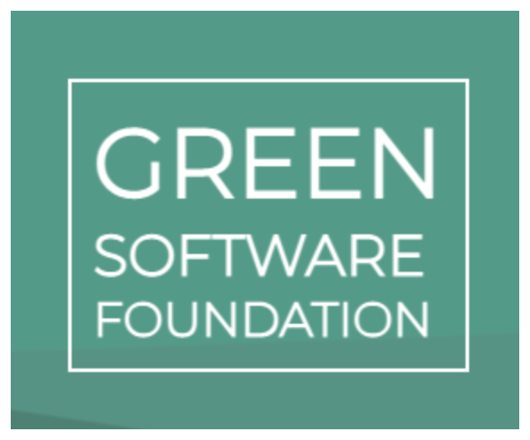
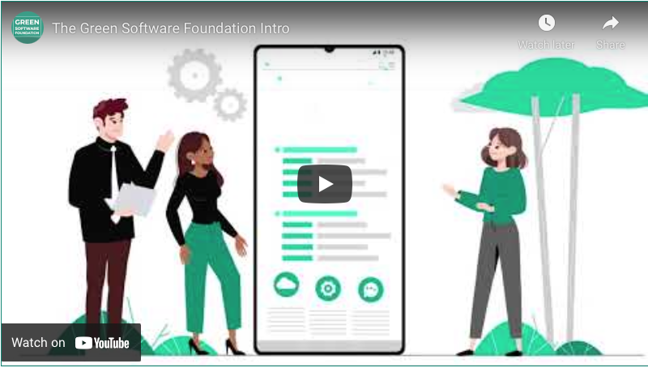

# Introduction
The Green Software Foundation was born out of a mutual desire and need to collaborate across the software industry. Organizations with a shared commitment to sustainability and an interest in green software development principles are encouraged to join the Foundation to help grow the field of green software engineering, contribute to standards for the industry, and work together to reduce the carbon emissions of software.

## Membership
We welcome organizations that can **demonstrate their commitment to sustainability**, either through a public sustainability commitment in the form of a page on your organization's website or through clear leadership in the space of sustainability and technology. Some examples of leadership might be (co)authoring papers or releasing open-source software related to the field.

## WG Areas
**[Standards](https://github.com/Green-Software-Foundation/standards_wg)**: Agreeing on standards, best practices and patterns for building green software.  
**[Innovation](https://github.com/Green-Software-Foundation/innovation_wg)**: Nurture the creation of trusted open-source and open-data projects and supporting academic research.  
**[Community](https://github.com/Green-Software-Foundation/community_wg)**: Facilitate the growth of a diverse and international community of green software ambassadors. 
**[Trademark](https://github.com/Green-Software-Foundation/trademark_wg)** Define guidance regarding when, how and in what context the Foundations trademarks can be used.

[JOIN OUR NEWSLETTER]()
